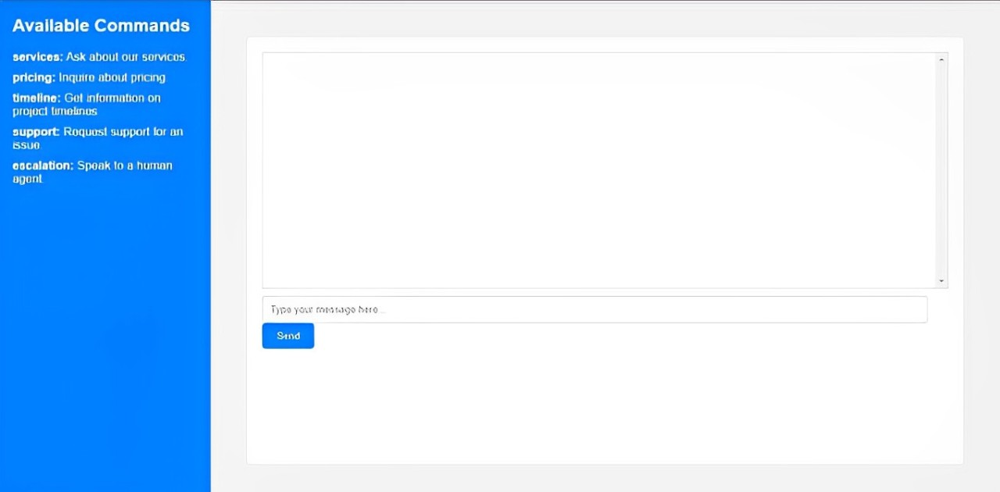

# Demo Customer Support Chatbot



This is a demo customer support chatbot designed for a digital marketing company. The chatbot can assist with answering common customer inquiries, providing basic information about services, and escalating issues to human agents when necessary.

Live Hosted Link: https://customer-support-chatbot.onrender.com/

## Features

- **Services Inquiry**: Provides information about the company's digital marketing services such as SEO, content marketing, PPC, and social media management.
- **Pricing Inquiry**: Offers details on pricing based on service and scope, and suggests contacting an agent for a custom quote.
- **Timeline Inquiry**: Shares information on project timelines, with examples like SEO campaigns.
- **Support Request**: Helps users with support issues by either resolving common problems or escalating them to a human agent.
- **Human Escalation**: Allows users to escalate issues to a human agent when necessary.

## Technologies Used

- **Python**: For backend logic and handling user inputs.
- **Flask**: For creating the web server and handling routes.
- **HTML/CSS**: For the frontend interface, including a chatbox and sidebar.
- **JavaScript**: For handling user interactions and updating the chat interface dynamically.

## Setup and Installation

1. **Clone the repository:**

    ```bash
    git clone https://github.com/yourusername/demo-customer-support-chatbot.git
    cd demo-customer-support-chatbot
    ```

2. **Install the required Python packages:**

    ```bash
    pip install flask
    ```


3. **Run the Flask app:**

    ```bash
    python app.py
    ```

4. **Access the application:**

    Open your web browser and navigate to `http://127.0.0.1:5000/`.

## Project Structure

```plaintext
├── app.py              # Main application file containing the Flask app and NLP logic
├── templates
│   └── index.html      # HTML file for the chatbot interface
└── README.md           # Project documentation
